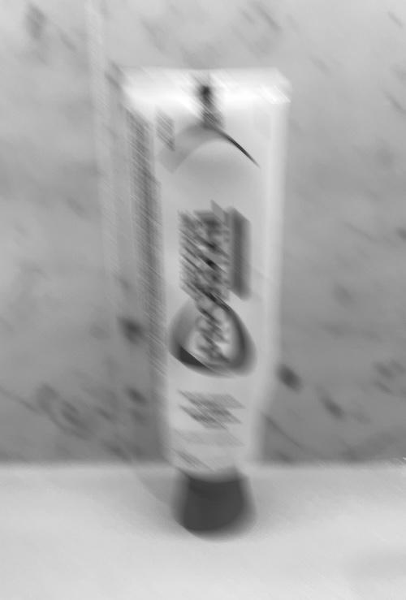
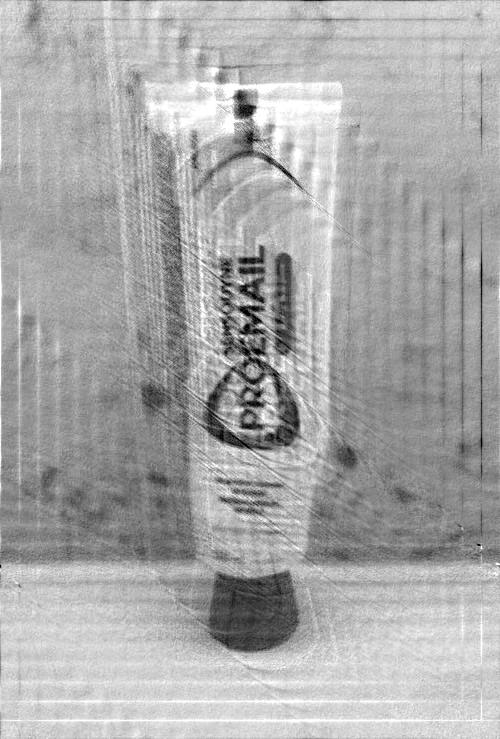
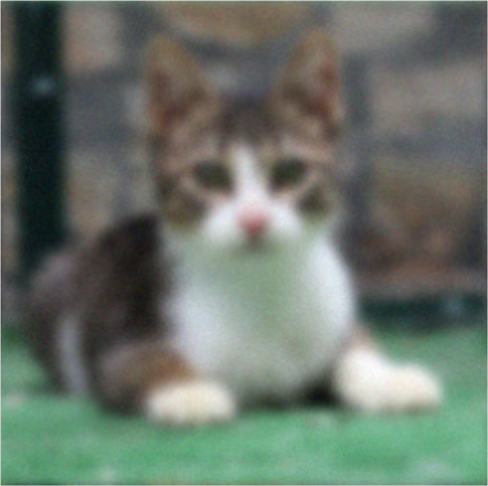
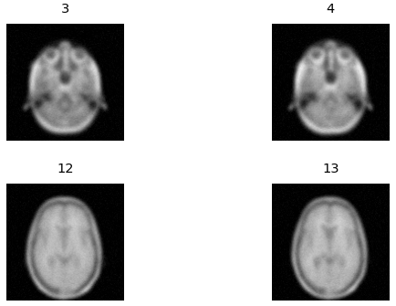
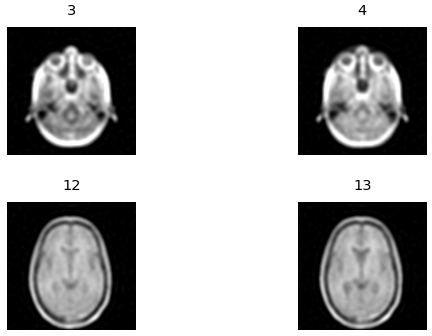

# Image Deblurring

*Using Tikhonov regularization across blur types.*

**Discrete Optimization Problems Project - 2025/26 W2, University of British Columbia**
Umay Gokturk · Tiffany Gong · Luna Kim

📄 **[Read the full report (PDF)](./Report.pdf)**

## Overview

Deblurring is an *inverse problem*: given a blurred image $b$ and a known blur operator $A$, recover the original $x$ from $Ax = b$. Inverting $A$ directly amplifies noise, so we use a single **Tikhonov regularization** pipeline made efficient with the **FFT** (periodic boundary conditions diagonalize the blur matrix), and apply it to three settings of increasing complexity. **Naive inversion** and **Truncated SVD** serve as baselines.

## Contributions

| Member | Part |
| --- | --- |
| Luna Kim | Linear motion blur |
| Tiffany Gong | Color blur |
| Umay Gokturk | 3D volumetric blur |

## Blur Types

### 🎞️ Linear Motion Blur
Blur along a straight line at an arbitrary angle (the PSF is a line), tested on both synthetic and real motion-blurred photos.

| Real motion-blurred | Recovered |
| :---: | :---: |
|  |  |

### 🌈 Color Blur
Extends the pipeline to RGB images, including cross-channel coupling where the channels mix through a Kronecker product.

| Blurred | Recovered |
| :---: | :---: |
|  |  |

### 🧊 3D Volumetric Blur
Extends the pipeline from pixels to voxels, deblurring a 3D volume (MRI data) with a 3D Gaussian PSF and a 3D FFT.

| Blurred | Recovered |
| :---: | :---: |
|  |  |

## Results

Across all three settings, Tikhonov regularization gave stable reconstructions where naive inversion and Truncated SVD broke down under noise. The regularization strength α was chosen via the L-curve (and relative error where the ground truth was known).

## Repository

| Notebook | Blur type |
| --- | --- |
| `motion_deblur_linear.ipynb` | Linear motion blur |
| `colorblurring.ipynb` | Color blur |
| `3D_blur/3D_blur.ipynb` | 3D volumetric blur |
| `visualization/` | PSF, blurring-matrix, and naive-solution visualizations |

**Requirements:** Python 3.x · NumPy · SciPy · Matplotlib · Pillow · CVXPY

## Reference

Core reference for the deblurring methods:

> Per C. Hansen, James G. Nagy, Dianne P. O'Leary. *Deblurring Images: Matrices, Spectra, and Filtering.* SIAM, 2006.

Also draws on the Gaussian kernel (Ter Haar Romeny, 2003) and MATLAB's `imgaussfilt3` - full credits in the [report](./Report.pdf).
